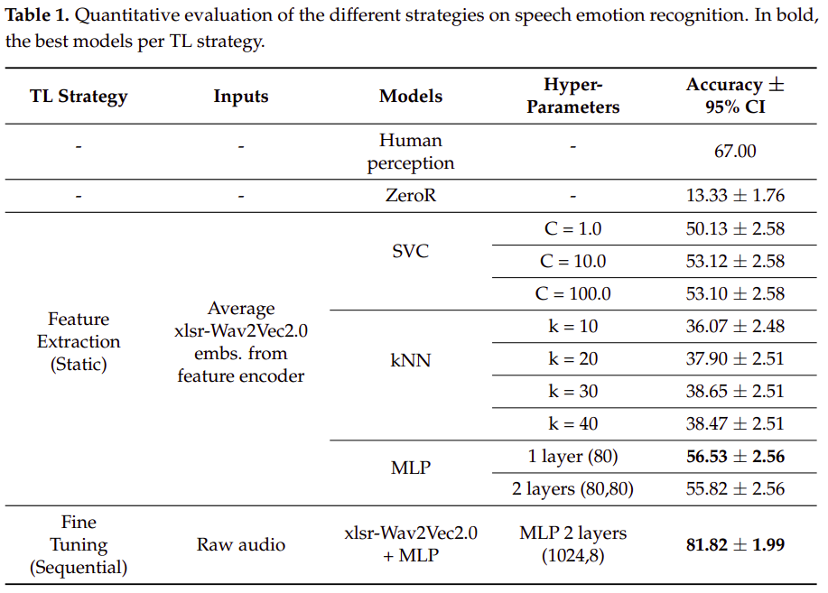
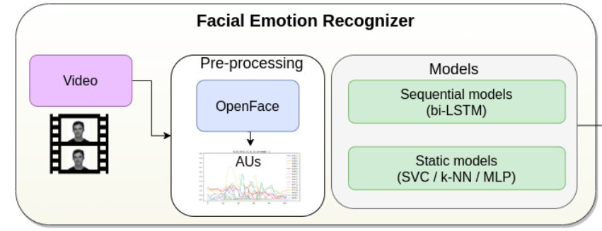
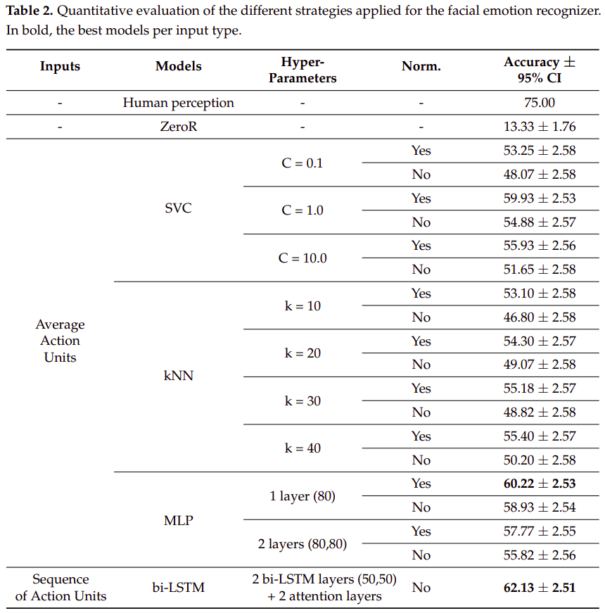
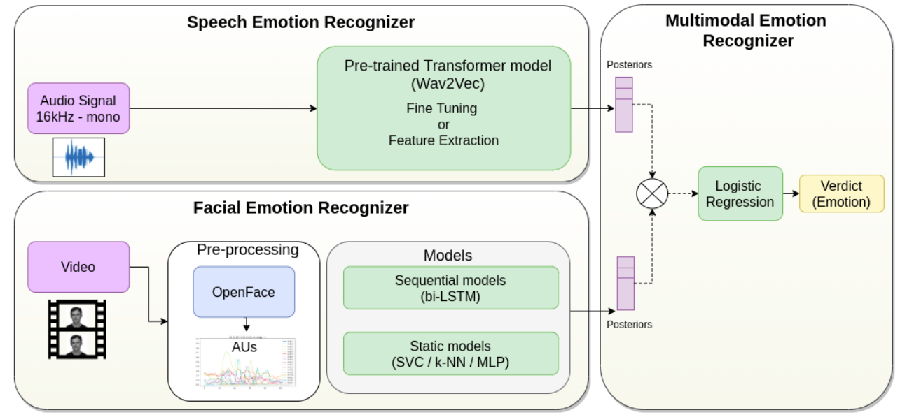
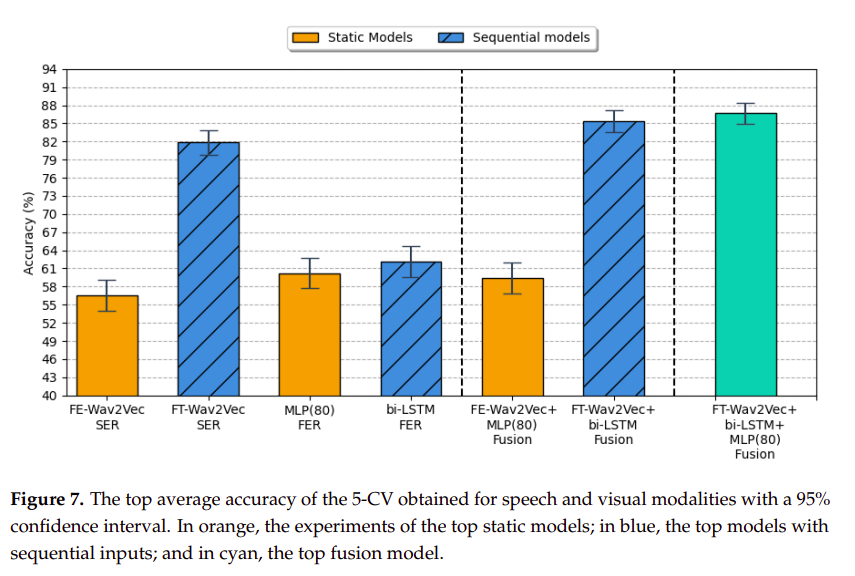

# Emotion Recognition from Video

Based on RAVDESSS Dataset

## Installation

Install ffmpeg from:

    https://www.ffmpeg.org/download.html#build-linux

To install the python packages, create a new virtual environment and run:

    pip install git+https://github.com/huggingface/datasets.git
    pip install git+https://github.com/huggingface/transformers.git
    pip install -r requirements.txt

\*\* If problems installing certain libraries, try to update your pip version: pip3 install --upgrade pip
and run again the previous command

## Download datasets

For reproducing the experiments, firt you need to download the dataset used for the experiments:

- [x] [RAVDESS](https://zenodo.org/record/1188976#.YFZuJ0j7SL8)

\*\*IMPORTANT NOTE: For training/testing the models, we only use 1.440 videos (only speech channel) not songs. See in MMEmotionRecognition/data/ravdess_videos.csv the name of these files.

Once downloaded, put them in your working directory, in what follows, we will refer to these directories as:

- \<RAVDESS_dir> : Root Directory where we downloaded RAVDESS dataset

## Prepare dataset (5 CV)

For evaluating our models, we used a subject-wise 5CV. The distribution per actor for the validation folds was as follows:

- Fold 0: (2, 5, 14, 15, 16);
- Fold 1: (3, 6, 7, 13, 18);
- Fold 2: (10, 11, 12, 19, 20);
- Fold 3: (8, 17, 21, 23, 24);
- Fold 4: (1, 4, 9, 22).

## Speech Emotion Recognition:

### Pre-processing

To extract the audios from the videos and change their format to 16kHz & single channel, run:

    python3 MMEmotionRecognition/src/Audio/preProcessing/process_audio.py
             --videos_dir <RAVDESS_dir>/videos
             --out_dir <RAVDESS_dir>/audios_16kHz

### Fine-Tuning

#### Training

To fine-tune the xlsr-Wav2Vec2.0 model, run:

    python3 MMEmotionRecognition/src/Audio/FineTuningWav2Vec/main_FineTuneWav2Vec_CV.py
    --audios_dir <RAVDESS_dir>/audios_16kHz --cache_dir MMEmotionRecognition/data/Audio/cache_dir
    --out_dir <RAVDESS_dir>/FineTuningWav2Vec2_out
    --model_id jonatasgrosman/wav2vec2-large-xlsr-53-english

After finishing the fine-tuning process, the datasets and the trained models will be saved in the folder <RAVDESS_dir>/FineTuningWav2Vec2_out

**Important Note:** Results can vary a little from the reported in the paper because we added some extra lines to optimize the saving of the weights, which affects to the randomization of the training

#### Evaluation

To evaluate and get some metrics of the trained model, you should run the Wav2Vec2.0 script, as in the example below. Notice that you should modify
the dict of line 119 (checkpoints_per_fold) to the top models in case you changed the seed or used the code for other tasks.

    python3 MMEmotionRecognition/src/Audio/FineTuningWav2Vec/Wav2VecEval.py
             --data <RAVDESS_dir>/FineTuningWav2Vec2_out/data/YYYYMMDD_HHMMSS
             --fold 0
             --trained_model <RAVDESS_dir>/FineTuningWav2Vec2_out/trained_models/wav2vec2-xlsr-ravdess-speech-emotion-recognition/YYYYMMDD_HHMMSS
             --out_dir <RAVDESS_dir>/FineTuningWav2Vec2_posteriors
             --model_id jonatasgrosman/wav2vec2-large-xlsr-53-english

To evaluate our models and generate the posteriors, the code to execute would be the following:

    python3 MMEmotionRecognition/src/Audio/FineTuningWav2Vec/Wav2VecEval.py
             --data MMEmotionRecognition/data/models/wav2Vec_top_models/FineTuning/data/20211020_094500
             --fold 0
             --trained_model MMEmotionRecognition/data/models/wav2Vec_top_models/FineTuning/trained_models/wav2vec2-xlsr-ravdess-speech-emotion-recognition/20211020_094500
             --out_dir <RAVDESS_dir>/FineTuningWav2Vec2_posteriors
             --model_id jonatasgrosman/wav2vec2-large-xlsr-53-english

Notice that for the evaluation, you will get the metrics per fold, so for obtaining the final average accuracy, you should have run the previous command changing the fold to 0, 1, 2, 3, and 4.
After running the precious command 5 times, we will run the following script to obtain the final accuracy (plotted on the console):

     python3 MMEmotionRecognition/src/Audio/FineTuningWav2Vec/FinalEvaluation.py
             --dataPosteriors MMEmotionRecognition/data/models/wav2Vec_top_models/FineTuning/posteriors/20211020_094500
             --trained_model MMEmotionRecognition/data/models/wav2Vec_top_models/FineTuning/trained_models/wav2vec2-xlsr-ravdess-speech-emotion-recognition/20211020_094500

### Feature Extraction from xlsr-Wav2Vec2.0

#### Extract embeddings

To extract the features, first, we need to run the fine-tuning section to generate the train.csv and test.csv files. After running previous section, we could extract the features from the generated files, running the following command:

    python3 MMEmotionRecognition/src/Audio/FeatureExtractionWav2Vec/FeatureExtractor.py
    	 --data MMEmotionRecognition/data/models/wav2Vec_top_models/FineTuning/data/20211020_094500
    	 --model_id jonatasgrosman/wav2vec2-large-xlsr-53-english
    	 --out_dir <RAVDESS_dir>/FineTuningWav2Vec2_embs512

#### Train & Eval models

    python3 MMEmotionRecognition/src/Audio/FeatureExtractionWav2Vec/FeatureTraining.py
             --embs_dir <RAVDESS_dir>/embs512
             --model_number 11
             --param (80)
             --type_of_norm 2
             --out_dir MMEmotionRecognition/data/models/avg_MLP80_Audio

### Results SER

## Facial Emotion Recognition:

### Pre-processing

To extract the Action Units (AUs) using the OpenFace library, we run:

    python3 MMEmotionRecognition/src/Video/OpenFace/AUsFeatureExtractor.py
             --videos_dir <RAVDESS_dir>/videos
             --openFace_path <OpenFace_dir>
             --out_dir <RAVDESS_dir>/Extracted_AUs
             --out_dir_processed <RAVDESS_dir>/processed_AUs

### Training

Once we extract the embeddings, we can train the visual models:

#### Static Models:

To train and evaluate the static models, run the command below. Notice that this command will also save the posteriors
generated by the trained models in the path passed in out_dir.

     python3 MMEmotionRecognition/src/Video/models/staticModels/FeatureTrainingAUs.py
        --AUs_dir <RAVDESS_dir>/processed_AUs
    	 --model_number 11
    	 --param (80)
    	 --type_of_norm 1
    	 --out_dir MMEmotionRecognition/data/models/avg_MLP80_AUs/posteriors

#### Sequential Models:

See README in MMEmotionRecognition/src/Video/models/sequenceLearning/README_AUS.md

### Results FER

## Fusion

###Training & Evaluation

    python3 MMEmotionRecognition/src/Fusion/FusionTraining.py
    --embs_dir_wav2vec <RAVDESS_dir>/FineTuningWav2Vec2_posteriors/20211020_094500
    --embs_dir_biLSTM <RAVDESS_dir>/FUSION/wav2Vec_AUs/BiLSTM_AUS/posteriors
    --embs_dir_MLP MMEmotionRecognition/data/posteriors/avg_MLP80_AUs/posteriors
    --out_dir <RAVDESS_dir>/FUSION/posteriors
    --model_number 2
    --param 1.0
    --type_of_norm 1

To replicate our results, run:

    python3 MMEmotionRecognition/src/Fusion/FusionTraining.py
    --embs_dir_wav2vec MMEmotionRecognition/data/posteriors/wav2Vec/posteriors/20211020_094500
    --embs_dir_biLSTM MMEmotionRecognition/data/posteriors/AUs_biLSTM_6213/posteriorsv2
    --embs_dir_MLP MMEmotionRecognition/data/posteriors/avg_MLP80_AUs/posteriors
    --out_dir ''
    --model_number 2
    --param 1.0
    --type_of_norm 1

##Results Fusion
Top model Avg. Accuracy: 86.70%

## FAQs

### Trained models:

To download the weights of the trained models (only Wav2Vec2.0 and bi-LSTM), click on this linkB (~16GB):

https://drive.upm.es/s/AYULcdl44m2Tj8C

### Which videos should I use?

In total, they have to be 1440.
Check MMEmotionRecognition/data/ravdess_videos.csv for a complete list of the names of the used videos.

### Which are the outputs of the trained models?

Trained models follow this dictionary to do the predictions:
{'Angry': 0, 'Calm': 1, 'Disgust': 2, 'Fear': 3, 'Happy': 4, 'Neutral': 5, 'Sad': 6, 'Surprise': 7}
So,e.g. if we introduce a sample whose ground-truth is 'Angry', ideally, we would receive at the output something like: [1,0,0,0,0,0,0,0]
